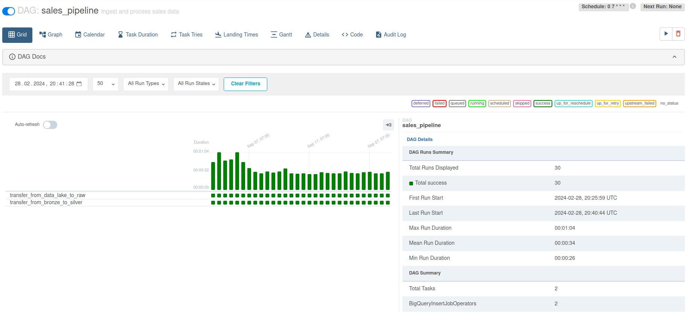
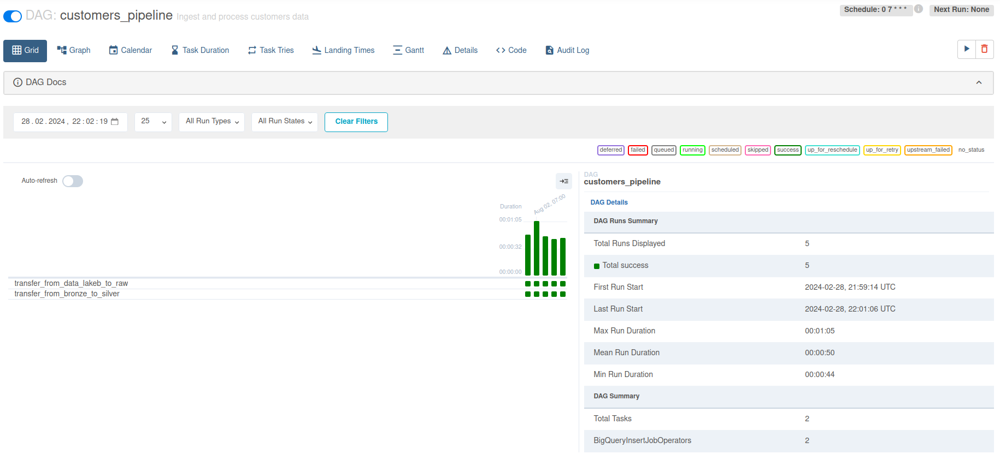
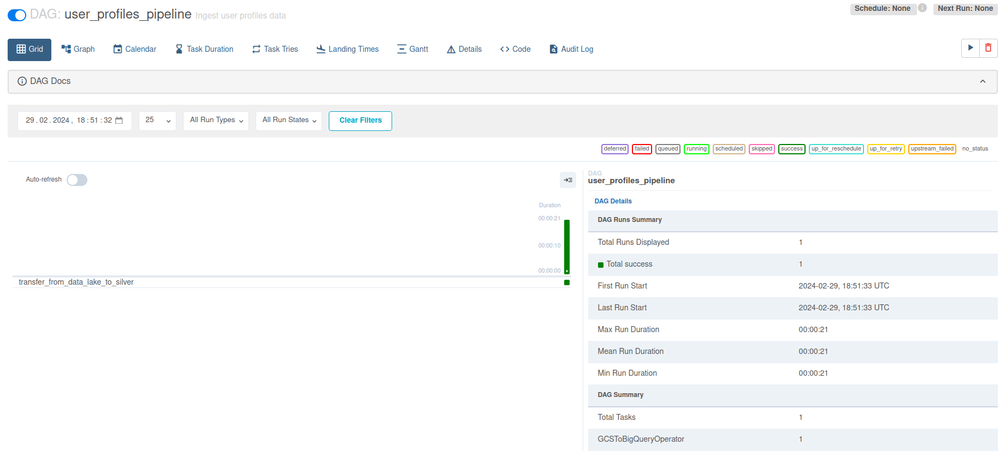
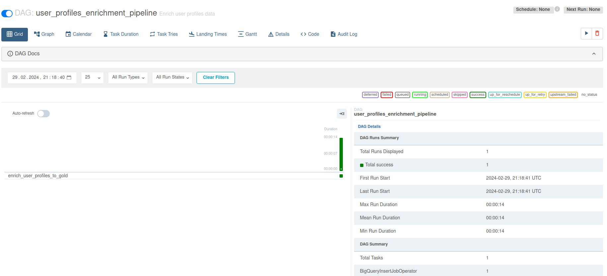
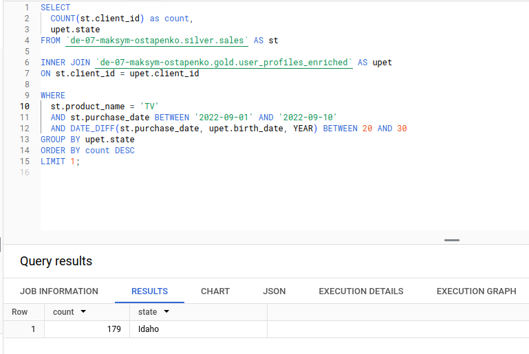

# Sales processing using Google Cloud

The main goal is to process sales data using GCS and BigQuery services.

Files from `data` folder containing raw data should be copied into a GCS bucket. 
In BigQuery 3 datasets have to be created: `bronze`, `silver` and `gold`.
Orchestration process is implemented using Apache Airflow.

There are four pipelines for sales data processing.

## process_sales pipeline

We insert data from raw-bucket into `bronze` using file reading. All fields have type STRING. In `sales` table of the `bronze` dataset all fields are also STRING.

Column names in `bronze` are:

`CustomerId, PurchaseDate, Product, Price`

During data transfer into `silver` we perform data cleaning. Thus, it has convenient fileds data types for data amalyzing. Column names are:

`client_id, purchase_date, product_name, price`

Here we decided to use partitioning. (Each date in a separate folder).

## process_customers pipeline

Data from this source comes in a way that every day we recieve dump from all previous days.
We don't partition them, because the size of data is not big.

Data is inserted into `bronze` and `siver`. In `silver` column name are:

`client_id, first_name, last_name, email, registration_date, state`

In `bronze` they are the same as in the .csv files.

## process_user_profiles pipeline
In `silver` customer data there are some empty data occurnesses.
We use user profiles data that comes in JSON format. This data is clean, we transfer them into `silver`.
This pipeline is triggered manually.

## enrich_user_profiles pipeline
This pipeline write data into a `gold` level. It contains data from `silver.customers` but all fields should be filled with data from `silver.user_profiles`.
Also we use additional fields from `silver.user_profiles` (for example `phone_number`).
This pipeline is also triggered manually, not scheduled.

## DAGs execution screenshots

## Query formed data
